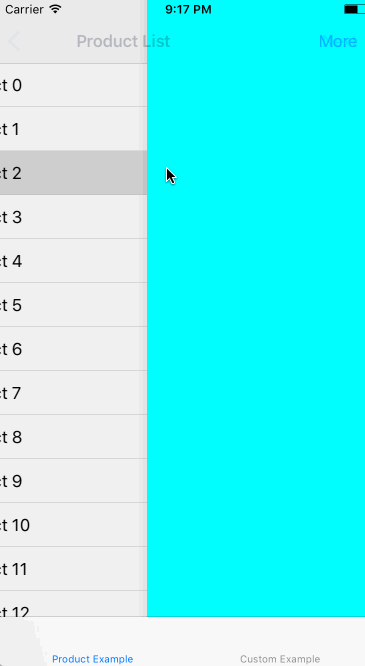
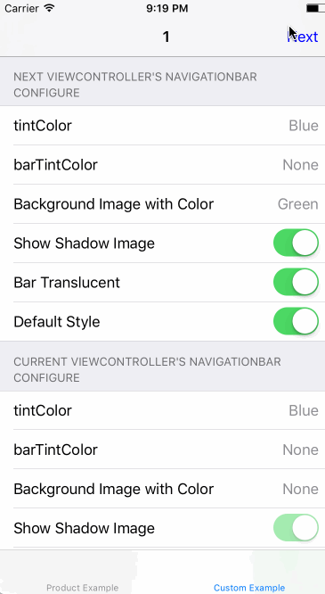

[](https://github.com/cuzv/RRNavigationBar/blob/master/LICENSE)
[](https://github.com/CocoaPods/CocoaPods)
[](http://weibo.com/cuzval/)
[](http://twitter.com/mochxiao)


# RRNavigationBar
bring `UINavigationBar` to` UIViewController`.

## Introduction

[KMNavigationBarTransition](https://github.com/MoZhouqi/KMNavigationBarTransition) provide a grace method deal with `navigationBar` transition, and requires zero  line of code changes, which is awesome.

Here is the situation I couldn't doing well by using [KMNavigationBarTransition](https://github.com/MoZhouqi/KMNavigationBarTransition): first page is a product list, click product line, push to product details page, requires transparent `navigationBar`, while you scrolling, it could recover to default `navigationBar`'s appearance. Continue  push to the next page, the `navigationBar` needs to look like the first page, which is the default appearance. (like the following 1st gif tells.)

In a word, what I wanted is change the  `navigationBar`'s appearance only affect current viewController, which is this repo trying to do.

<p align="left">


</p>

## Requirements

- iOS 7.0+

My working environment is iOS 10.2 + Xcode 8.2.1, the minimum support version is iOS7 in theory, but without test passed.

## CocoaPods

[CocoaPods](http://cocoapods.org) is a dependency manager for Cocoa projects.

CocoaPods 0.36 adds supports for Swift and embedded frameworks. You can install it with the following command:

```bash
$ gem install cocoapods
```

To integrate Redes into your Xcode project using CocoaPods, specify it in your `Podfile`:

```ruby
source 'https://github.com/CocoaPods/Specs.git'
platform :ios, '7.0'
use_frameworks!

pod 'RRNavigationBar'
```

Then, run the following command:

```bash
$ pod install
```

You should open the `{Project}.xcworkspace` instead of the `{Project}.xcodeproj` after you installed anything from CocoaPods.

## Usage

In ViewController's `viewDidLoad` method:

```Objec
self.rr_navigationBar.xxx = newValue;
```

If the viewController's view is activated, will take effect immediately, otherwise when `viewWillLayoutSubviews` called.

For more information see the demo in project.

## Supported Methods

- `barStyle`
- `translucent`
- `tintColor`
- `barTintColor`
- `backgroundColor`
- `shadowImage`
- `setBackgroundImage:forBarMetrics:`
- `alpha`
- `rr_forceShadowImageHidden`

Try not change `translucent` property, which is may cause navigationBar flash when animation complete with extends container ViewController's view backgroundColor.

Set `hidden`property will have no effect, try use `setBackgroundImage:forBarMetrics:` & `shadowImage` make navigationBar invisible.

## License

`RRNavigationBar` is available under the MIT license. See the LICENSE file for more info.

## Refrence

- [KMNavigationBarTransition](https://github.com/MoZhouqi/KMNavigationBarTransition)
